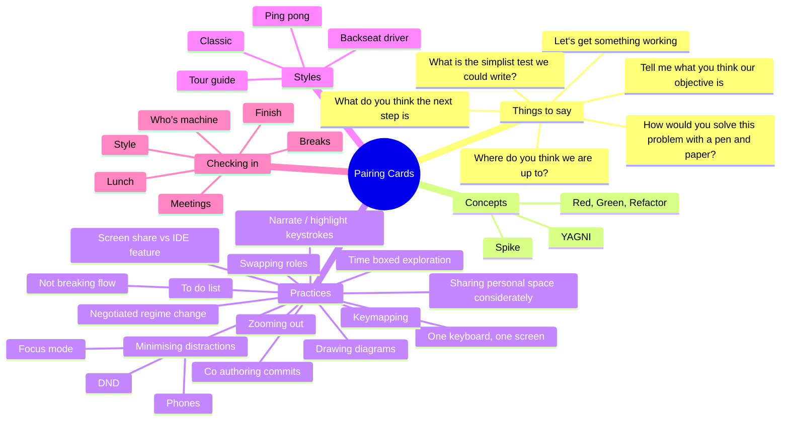

# pairing-cards
Design of a physical set of cards which facilitate conversations while pair programming

## Ideas

```mermaid
mindmap
    root((Pairing Cards))
        Things to say
            What do you think the next step is
            How would you solve this problem with a pen and paper?
            Let‘s get something working
            Tell me what you think our objective is
            Where do you think we are up to?
            What is the simplist test we could write?
        Concepts
            YAGNI
            Red, Green, Refactor
            Spike
        Practices
            One keyboard, one screen
            Screen share vs IDE feature
            To do list
                Not breaking flow
            Zooming out
            Narrate / highlight keystrokes
            Time boxed exploration
            Negotiated regime change
            Minimising distractions
                Phones
                Focus mode
                DND
            Co authoring commits
            Drawing diagrams
            Swapping roles
            Sharing personal space considerately
            Keymapping
        Styles
            Ping pong
            Classic
            Tour guide
            Backseat driver
        Checking in
            Style
            Who’s machine
            Lunch
            Meetings
            Breaks
            Finish
```
