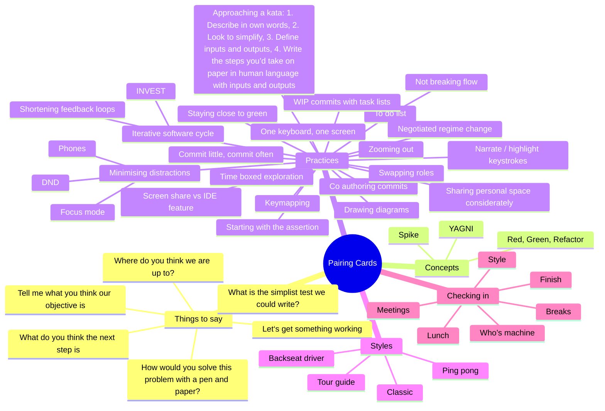

# pairing-cards
Design of a physical set of cards which facilitate conversations while pair programming

## Ideas

## Concepts

### Approaching a kata

1. Describe the task in your own words  
   This helps to ensure that you actually understand it and that your understanding is the same as the other person's. Using your own words forces your brain to think about it differently. You might find at this point that you can’t describe it.
1. Look at how you can simplify it  
   Finding a starting point for a problem can be tough. If there’s a way to simplify the problem, you can get started quicker. If there are four rules, only consider the first one. Would it be easier to solve if there were only one item of input? Perhaps you can use some really simple input to start with so that you don’t need to consider different formats, etc.
1. Define the inputs and outputs  
   Think about the problem as a function. What are the parameters? Do they have specific types? What do the items represent? What value do you need to return, and what type is it?
1. Write the steps you’d take
   Although you might not think you know how to write code to solve it, you can probably describe how you would solve the problem with a pen and paper. Write these steps down in human language. Perhaps consider what the inputs and outputs of each step are. This will give you an idea of how you can get started and allow you to keep track of how far through you are.
